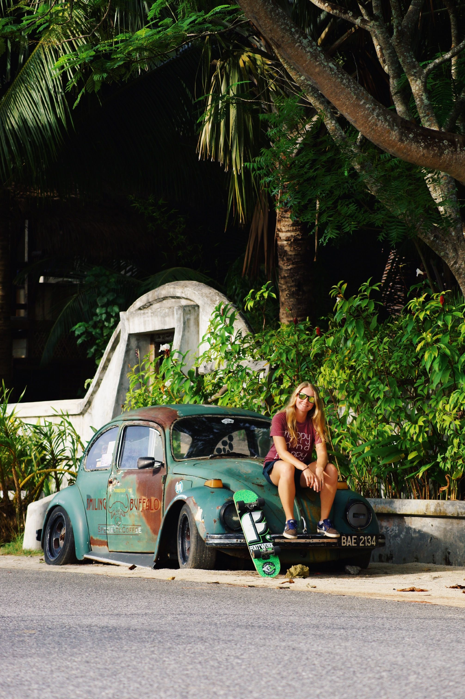
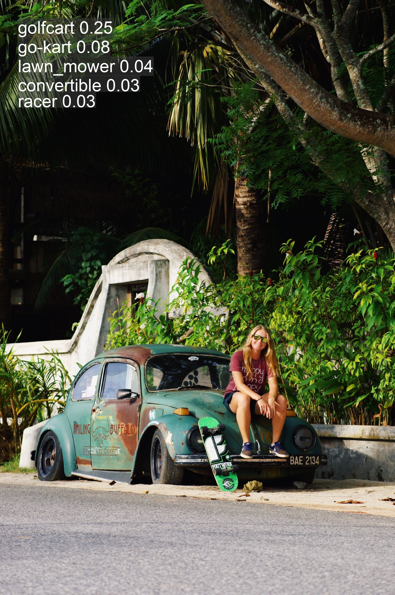
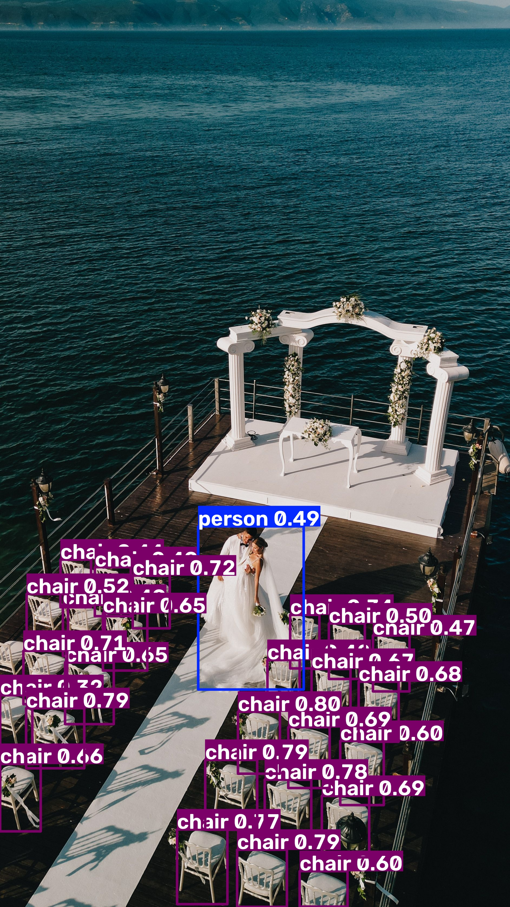
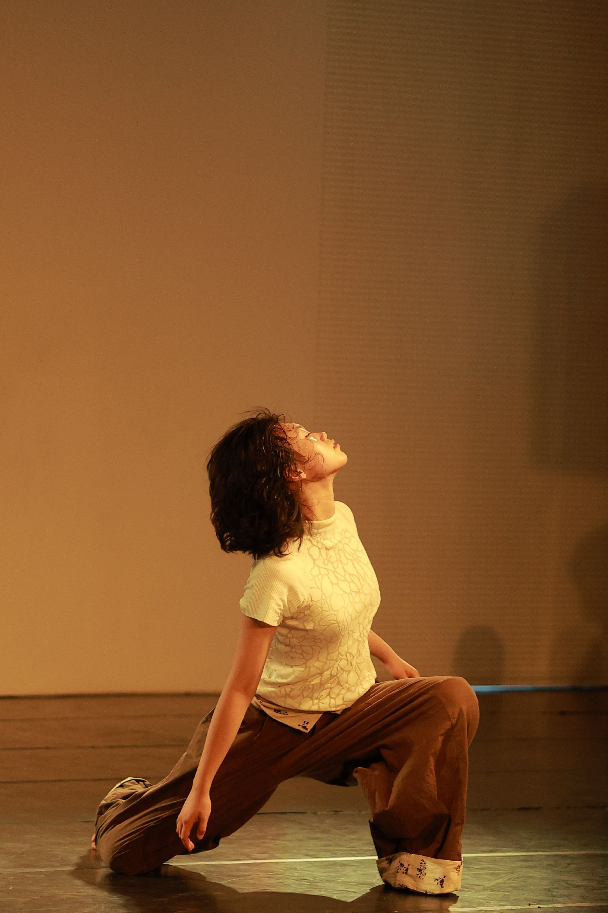
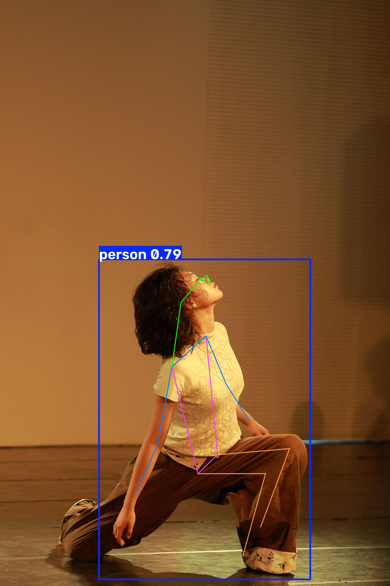
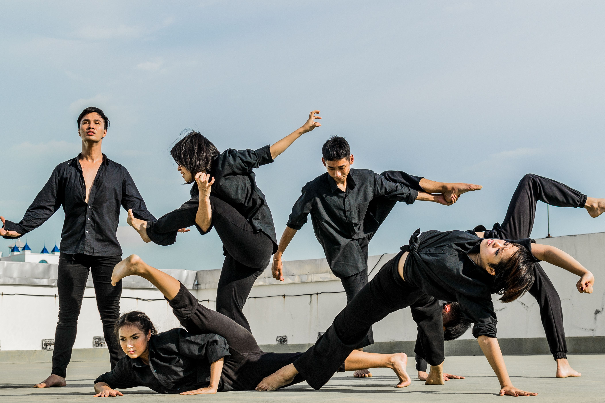
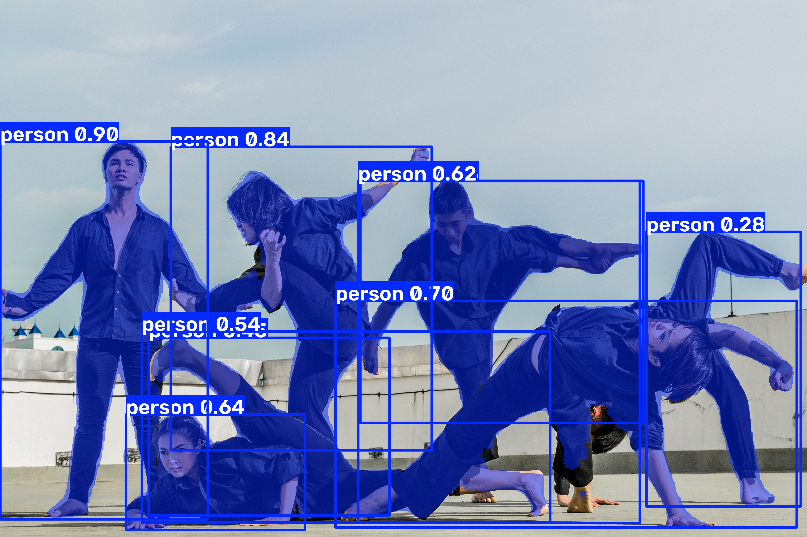

# [yolo 01-12] 분류·탐지·자세·분할부터 실시간 스트리밍 추적까지

> 작성: 2026-07-20 | 수정: 2026-07-20

## 폴더별 코드로 보는 학습 흐름

`13_yolo/basic`, `13_yolo/advanced` 폴더의 `.py` 파일을 학습 순서대로 읽었을 때 드러나는 흐름 정리.

**4가지 핵심 기능 (`yolo_classification.py` / `yolo_detection.py` / `yolo_pose.py` / `yolo_seg.py`)**: 네 파일 모두 "모델 로드 → `model("이미지경로")` 추론 → `results[0].plot()`로 시각화 → `cv2.imwrite()`로 저장"이라는 완전히 동일한 4단계 뼈대를 공유하고, 차이는 오직 **모델 가중치 파일(`.pt`)** 하나뿐이다. `yolo11n-cls.pt`(분류: "이게 뭐야?" 정답 하나), 기본 `yolo11x.pt`(탐지: 여러 물체 위치 박스), `yolo11n-pose.pt`(자세: 관절 17개 점), `yolo11n-seg.pt`(분할: 물체 외곽선)로 태스크가 바뀐다. 같은 파이프라인에 모델만 갈아끼우면 완전히 다른 결과가 나온다는 걸 나란히 비교하며 확인한 파일들.

**파라미터 튜닝 (`yolo_params.py`)**: `model.names`로 COCO 80개 클래스 이름을 먼저 확인하고, `classes=[60, 75]`로 원하는 클래스만 골라 탐지하도록 필터링한다. `runs/detect/predict-4`의 `crops/person`, `crops/cup`, `crops/bowl` 등과 `predict-5/labels`를 보면, 스크립트에 남아있는 `classes`/`save` 외에도 `save_crop`(탐지된 물체만 잘라 저장), `save_txt`(좌표를 텍스트로 저장) 같은 옵션까지 실험해본 흔적이 있다 — 같은 사진(`input_params.jpg`, `input_params2.jpg`)으로 predict 폴더가 9개까지 쌓인 것도 그 실험 과정.

**실시간 스트리밍 처리 (`yolo_http.py` → `yolo_count.py`)**: 이 둘은 이어지는 관계다. `yolo_http.py`가 `cv2.VideoCapture(stream_url)`로 CCTV의 `.m3u8`(HLS) 주소를 읽어 `while cap.isOpened()` 루프 안에서 프레임마다 추론하는 기본형이고, `yolo_count.py`는 같은 루프 구조에 `len(results[0].boxes)`로 탐지 개수를 세고 `WARNING_THRESHOLD` 기준으로 Safe/Warning 상태를 판정해 `cv2.putText()`로 화면에 표시하는 응용형이다. 정지 이미지 추론에서 "실시간 영상 + 판단 로직"으로 넘어가는 지점.

**객체 추적 (`advanced/yolo_track.py`)**: `model()` 대신 `model.track(frame, persist=True, conf=0.6)`을 써서 프레임마다 새로 탐지하는 게 아니라 이전 프레임의 물체와 같은 물체면 같은 ID를 유지하도록 추적한다. 다만 오늘 실습에서 `cap = cv2.VideoCapture("https://www.earthcam.com/...")`처럼 **일반 웹페이지 주소**를 넣어 실행이 안 되는 문제를 발견 — 아래 Q&A 참고.

━━━━━━━━━━━━━━━━━━━━━━━━━━━━━━━━━━━━━━━━

## Q&A

**Q. `yolo_track.py`에서 EarthCam 웹페이지 주소를 넣었더니 실행이 안 된다. 왜 그런가?**

`cv2.VideoCapture()`는 사람이 브라우저로 보는 **웹페이지(HTML) 주소**를 열 수 없다. ffmpeg 백엔드가 이해하는 **직접적인 영상 스트림 주소**(`.m3u8`, `.mp4`, `rtsp://` 등)만 인자로 받을 수 있어서, `https://www.earthcam.com/world/ireland/dublin/?cam=templebar` 같은 페이지 URL을 그대로 넣으면 `cap.isOpened()`가 열리지 않거나 `cap.read()`가 바로 실패해 "프레임 읽기 실패" 분기로 빠지고 루프가 끝나버린다. 같은 폴더의 `yolo_http.py`, `yolo_count.py`가 쓰는 `.../playlist.m3u8`처럼, 실제 스트림 주소는 브라우저 개발자 도구(Network 탭)에서 별도로 찾아야 한다.

━━━━━━━━━━━━━━━━━━━━━━━━━━━━━━━━━━━━━━━━

## 개념 요약

| 개념 | 설명 |
|---|---|
| 분류(Classification) | 사진 하나에 정답 클래스 하나. `yolo11n-cls.pt` |
| 탐지(Detection) | 여러 물체의 위치를 박스로 표시. 기본 `yolo11x.pt`/`yolo11n.pt` |
| 자세(Pose) | 사람 관절 17개 좌표를 점으로 표시. `yolo11n-pose.pt` |
| 분할(Segmentation) | 박스가 아닌 물체의 정확한 외곽선. `yolo11n-seg.pt` |
| `conf` | 신뢰도 임계값. 이 값보다 확신이 낮은 탐지는 버림 |
| `classes=[...]` | COCO 클래스 번호로 원하는 물체만 필터링 |
| `model.track(persist=True)` | 프레임 간 같은 물체에 같은 추적 ID를 유지 |
| 스트림 URL | `cv2.VideoCapture()`에는 웹페이지가 아닌 `.m3u8`/`rtsp` 등 직접 스트림 주소만 가능 |

```python
# 4대 기능 공통 뼈대 (모델 파일만 바뀜)
model = YOLO("yolo11n-seg.pt")          # cls / (기본) / pose / seg
results = model("./input.jpg")
result_image = results[0].plot()
cv2.imwrite("./result.jpg", result_image)

# 원하는 클래스만 탐지
model = YOLO("yolo11n.pt")
model("input.jpg", classes=[60, 75], save=True)  # 60=식탁, 75=꽃병 등

# 실시간 스트림 + 상태 판정
cap = cv2.VideoCapture("https://.../playlist.m3u8")  # 반드시 직접 스트림 주소
while cap.isOpened():
    success, frame = cap.read()
    if not success:
        break
    results = model(frame)
    count = len(results[0].boxes)
    status = "Warning" if count >= WARNING_THRESHOLD else "Safe"

# 추적: 프레임마다 새로 세지 않고 ID를 유지
results = model.track(frame, persist=True, conf=0.6)
```

**실무 예시**: 4대 기능 중 어떤 걸 쓸지는 "무엇을 판단해야 하는가"로 정해진다 — 상품 하나만 있는 사진에서 카테고리를 알고 싶으면 분류, 매장 CCTV에서 사람·카트 위치를 알고 싶으면 탐지, 헬스장 자세 교정 앱이면 포즈, 자율주행에서 도로 경계를 정확히 따야 하면 분할을 쓴다. `classes` 필터링은 매장 CCTV에서 "사람과 카트만" 세는 식으로 불필요한 클래스(의자, 화분 등)를 걸러내 오탐을 줄일 때 실무에서 그대로 쓰인다. `persist=True` 추적은 매장 동선 분석에서 "같은 사람이 몇 개 구역을 돌았는지" 세려면 필수인데, 이게 없으면 프레임마다 새 사람으로 잘못 카운트된다. 스트림 URL 문제는 실무에서 CCTV/IP카메라 연동 시 가장 흔한 삽질 포인트라, 항상 "이 주소가 브라우저용 페이지인지, 순수 스트림 엔드포인트인지"부터 확인하는 습관이 필요하다.

━━━━━━━━━━━━━━━━━━━━━━━━━━━━━━━━━━━━━━━━

## [수정: 2026-07-20] 4대 기능 파이프라인 상세 (입출력 이미지 포함)

분류·탐지·자세·분할 4개 파일은 아래처럼 **완전히 동일한 4단계 뼈대**를 쓰고, "모델 가중치 파일"과 "입출력 이미지 파일명"만 다르다.

```python
from ultralytics import YOLO
import cv2

# 1. 모델 로드 (태스크별 가중치만 다름)
model = YOLO("가중치.pt")

# 2. 모델 추론 (이미지 경로 입력)
results = model("입력이미지.jpg")

# 3. 결과 시각화 (박스/점/외곽선을 이미지 위에 그려줌)
result_image = results[0].plot()

# 4. 결과 이미지 저장
cv2.imwrite("결과이미지.jpg", result_image)
```

`results[0].plot()` 한 줄이 태스크가 뭐든 상관없이 "탐지 결과를 이미지 위에 그려서 반환"해주기 때문에, 4개 파일이 겉보기엔 거의 복붙 수준으로 똑같다.

| 파일 | 모델(`.pt`) | 입력 이미지 | 출력 이미지 | 결과로 나오는 것 |
|---|---|---|---|---|
| `yolo_classification.py` | `yolo11n-cls.pt` | `input.jpg` | `result.jpg` | 이미지 전체에 대한 **클래스 이름 1개**(예: "cat 0.92") 텍스트만 얹힘, 박스 없음 |
| `yolo_detection.py` | `yolo11x.pt` (기본 탐지, x=최대형) | `input_det.jpg` | `result_det.jpg` | 사진 속 **여러 물체마다 사각형 박스 + 클래스명 + 신뢰도** |
| `yolo_pose.py` | `yolo11n-pose.pt` | `input_pose.jpg` | `result_pose.jpg` | 사람의 **관절 17개 점 + 뼈대 연결선(스켈레톤)** |
| `yolo_seg.py` | `yolo11n-seg.pt` | `input_seg.jpg` | `result_seg.jpg` | 물체의 **정확한 윤곽선을 따라 색칠된 마스크** |

**분류** — `input.jpg` → `result.jpg`

| 입력 | 결과 |
|---|---|
|  |  |

박스가 하나도 없고 이미지 좌상단에 클래스명+확률 텍스트만 찍힌다. "이 사진 전체가 뭔지" 하나만 답하는 태스크라 위치 정보 자체가 없다.

**탐지** — `input_det.jpg` → `result_det.jpg`

| 입력 | 결과 |
|---|---|
|  |  |

유일하게 모델이 `yolo11x.pt`(nano가 아니라 x, 즉 가장 크고 정확한 버전)다. `_det` 접미사에서 알 수 있듯 탐지 전용으로 별도 관리되는 이미지 쌍이고, 사진 속 사람·물체마다 박스가 여러 개 그려진다.

**자세** — `input_pose.jpg` → `result_pose.jpg`

| 입력 | 결과 |
|---|---|
|  |  |

`-pose.pt` 모델은 박스 대신 좌표점(keypoint) 17개를 예측하므로, `plot()` 결과에는 사람 관절 위치에 점이 찍히고 팔다리를 잇는 선이 그려진다. 사람이 없는 사진이면 아무것도 안 그려진다.

**분할** — `input_seg.jpg` → `result_seg.jpg`

| 입력 | 결과 |
|---|---|
|  |  |

유일하게 `model(..., save=True)`처럼 추론 단계에서 `save=True`를 추가로 넘겨서, `cv2.imwrite`로 직접 저장하는 `result_seg.jpg`와 별개로 `runs/segment/predict/input_seg.jpg`에도 자동 저장본이 하나 더 남는다. 그 결과 이 폴더만 결과 이미지가 두 군데(수동 저장 + 자동 저장)에 존재한다.

> Velog로 옮길 때는 각 `` 자리에 걸린 실제 파일(`13_yolo/basic/` 안의 jpg)을 velog 에디터에 직접 드래그해서 업로드하면, 자동 발급되는 CDN 주소로 이미지가 바로 치환된다.
